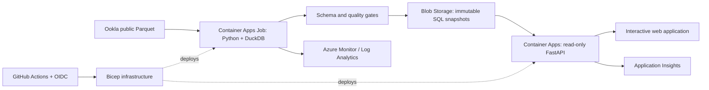

# Azure Telecom Cloud

A reproducible cloud data platform for exploring observed connectivity in Madrid and Fayetteville. Built by Victor Manuel Cabaleiro Valado to connect telecommunications engineering, statistical analysis and Azure operations.

**Current status:** real-source ingestion and local application verified. Azure infrastructure is implemented in Bicep and compiled locally. Cloud deployment, container execution, GitHub Actions runs and cloud costs are not yet verified. See [verification](docs/VERIFICATION.md).

## What it does

- Reads public Ookla Parquet data for fixed/mobile connections, Q3–Q4 2024.
- Validates 7,403 tile-period observations across eight study-area partitions.
- Publishes immutable SQLite analytical snapshots, with atomic release switching.
- Serves parameterized SQL queries through a read-only FastAPI application.
- Provides an interactive geographic plot, sample-size filters, matched-tile comparisons and CSV export.
- Defines Azure Container Apps, a processing Job, Blob Storage, separate managed identities, scoped RBAC, Log Analytics and Application Insights in Bicep.
- Includes CI, image-build and OIDC deployment workflows, plus a static portfolio edition.

The shipped study window is historical and deliberately bounded. It is not a live network-monitoring system. The configured quarters do not advance automatically.

## Try it locally

Python 3.12 is required. From the repository root:

```bash
python3 -m venv .venv
source .venv/bin/activate
pip install -r requirements.lock
pip install --no-deps -e .
python scripts/bootstrap_demo.py
uvicorn telecom_cloud.api:app --host 127.0.0.1 --port 8765
```

Open http://127.0.0.1:8765. Bootstrapping uses the included, attributed real-data snapshot. It does not invent measurements or need Azure credentials.

To fetch public source files afresh (requires network access and DuckDB's httpfs extension):

```bash
python -m telecom_cloud.pipeline --config config.json
python scripts/export_demo.py
```

The pipeline re-reads selected sources, skips unchanged SQL partitions, replaces corrected partitions transactionally and removes partitions excluded by the new configuration. This is incremental at the partition/storage level; it is not a CDC or streaming pipeline. Failed input validation cannot replace the last good release.

## Verify

```bash
ruff check src tests scripts
pytest -q
bicep build infra/main.bicep
bicep build infra/budget.bicep
```

Synthetic rows exist only in unit tests. The demo contains real, publicly sourced observations with logical partition hashes. Test scope and outstanding cloud checks are in [VERIFICATION.md](docs/VERIFICATION.md).

## Run as a container

```bash
docker build -t azure-telecom-cloud:local .
docker run --rm -p 8765:8000 \
  -e TELECOM_DATA_DIR=/data \
  -v "$PWD/data/processed:/data:ro" azure-telecom-cloud:local
```

The container runs as a non-root user. No account keys or `.env` files are included. Docker was not available on the authoring machine; image execution remains a separate check.

## Azure architecture



Read [architecture decisions](docs/ARCHITECTURE.md), [deployment and recovery](docs/RUNBOOK.md), [data methodology](docs/METHODOLOGY.md) and [learning guide](docs/LEARNING.md).

## Why these choices?

Azure is the operating environment; telecom is the domain. An immutable file-backed SQL snapshot is sufficient for this bounded, read-heavy application. It avoids the fixed cost and operational burden of a continuously running database server. Azure SQL, private networking and event-driven orchestration are documented extensions, not claims about the current implementation.

## Portfolio edition

`dist/` is a self-contained static website. Serve it with `python -m http.server 8766 --directory dist`. It visibly identifies itself as a static data snapshot. The static edition uses the same data and calculations and does not silently mask a failed live API.

Professional descriptions and a demo script are provided in [PROFILE-DRAFTS.md](docs/PROFILE-DRAFTS.md). Publication and profile edits have not been performed.

## Data attribution and license

Source: [Speedtest by Ookla Global Fixed and Mobile Network Performance Maps](https://github.com/teamookla/ookla-open-data), accessed 3 October 2026. Periods: Q3–Q4 2024. This project filters tile centroids into two study rectangles and derives weighted summaries and matched-tile comparisons. It is independent of Ookla and Microsoft.

Source and derived data: **CC BY-NC-SA 4.0**. See [DATA-LICENSE.md](DATA-LICENSE.md). Original project code: MIT. Source measurements are a self-selected sample; no household coverage, outage, causal, operator-ranking or compliance claim is supported.
