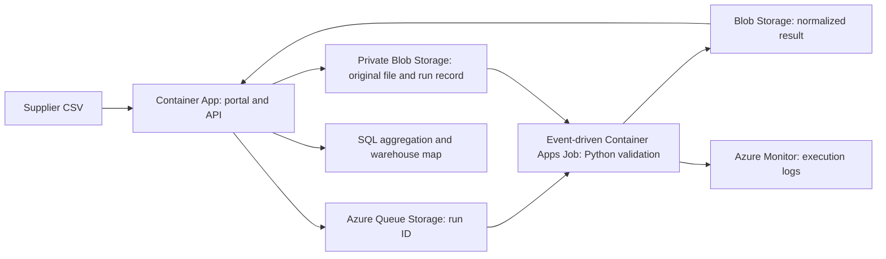

# Azure Operations Data Platform

An Azure portfolio project by **Victor Manuel Cabaleiro Valado**: receive supplier inventory files, check them, and publish a consistent view of electronics stock across **Madrid Centro, Leganés, Sanchinarro and Pedrezuela**.

The business is fictional. All suppliers, products, quantities and warehouse locations are synthetic demonstration data. The map uses the OpenFreeMap Bright vector basemap with optional 3D buildings, based on OpenStreetMap; markers do not identify real company premises.

[Live Azure application](https://operations-web.icystone-6e204dad.westus2.azurecontainerapps.io) · [Free read-only demo](https://victorcabaleirovalado.github.io/azure-operations-data-platform/)

## Try the workflow

1. Select a warehouse on the map. Its inventory and processing history become the active view.
2. Open **Recibir archivos**, select a supplier and download its sample CSV.
3. Upload it and follow the processing result. Re-uploading identical contents returns the same processing ID.
4. For Centro / Nexo, upload the error example, inspect the rejected rows, then upload the correction. Invalid data cannot replace valid inventory.

The public Azure demo accepts only the supplied fixtures. Run locally to experiment with your own CSV files. Files are complete snapshots for one supplier and warehouse, not deliveries to add repeatedly to existing stock.

## Azure does the work



The portal and processor use separate managed identities. Permissions are scoped to the project container and queues. Account keys are disabled. Bicep defines the infrastructure; GitHub Actions tests the code and builds an immutable image in the project registry. The worker scales from zero when a message arrives and acknowledges it after processing.

**SQL engine:** DuckDB inside the API. Persistent records are private blobs. Azure SQL, Data Factory, production user authentication and a commercial inventory-management system are outside this implementation. The design intentionally fits a small, bounded student demonstration.

## Status and evidence

See [VERIFICATION.md](docs/VERIFICATION.md) for exactly what has been run locally and in Azure. A static Pages copy is a read-only demonstration, explicitly labelled; it cannot run cloud processing. Never infer Azure execution from a screenshot of the static copy.

## Run locally

Requires Python 3.12 and a modern browser.

```bash
python3 -m venv .venv
source .venv/bin/activate
pip install -r requirements.lock
pip install --no-deps -e .
python scripts/seed_operations.py
uvicorn operations_cloud.api:app --host 127.0.0.1 --port 8765
```

Open http://127.0.0.1:8765. The local worker uses the same validation and processing functions as Azure. Local storage uses atomic files and file locks; Azure uses Blob Storage leases and Queue Storage. No Azure credentials are needed locally.

```bash
ruff check src tests scripts
pytest -q
python scripts/export_operations.py
node scripts/check_operations.mjs
bicep build infra/main.bicep
bicep build infra/budget.bicep
```

## Code tour

| File | Responsibility |
|---|---|
| `catalog.py` | Four warehouse locations, three suppliers and twelve product references |
| `validation.py` | CSV formats, row checks and normalization to integer euro cents |
| `store.py` | Atomic local files, private Azure blobs, locks and queue submission |
| `service.py` | Content-based IDs, run lifecycle, snapshot selection and SQL aggregation |
| `worker.py` | Receive a queue message, process it, acknowledge or retry it |
| `api.py` | Portal endpoints, public fixture restriction and local processing loop |
| `web/` | Spanish interface, warehouse map and filters |
| `infra/main.bicep` | Azure resources and scoped managed-identity permissions |

Python modules live in `src/operations_cloud/`. [Spanish learning guide](docs/LEARNING.md) · [Data definitions](docs/METHODOLOGY.md) · [Architecture decisions](docs/ARCHITECTURE.md) · [Runbook](docs/RUNBOOK.md) · [Costs](docs/COSTS.md).

## Portfolio scope

This project demonstrates cloud data integration, event-driven processing, validation, SQL, infrastructure as code, container deployment and operational troubleshooting. It does not establish professional client experience or measured business savings. [Profile drafts](docs/PROFILE-DRAFTS.md) distinguish implemented capabilities from verified deployment.

The previous telecommunications project is preserved in Git at tag `telecom-v1`. The existing repository and local folder are being reused to preserve history.

Original code and synthetic data: MIT. Leaflet: BSD-2-Clause; MapLibre GL JS: BSD-3-Clause; MapLibre Leaflet adapter: ISC. Licences are bundled in `web/vendor/`. Map attribution: [OpenStreetMap contributors](https://www.openstreetmap.org/copyright). See [DATA-LICENSE.md](DATA-LICENSE.md).
