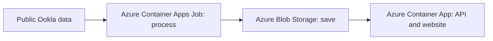

# Azure Telecom Cloud

An internet-speed explorer for Madrid and Fayetteville, built by Victor Manuel Cabaleiro Valado. I chose these areas because my background connects telecommunications engineering in Madrid with graduate study in Arkansas.

The question is simple: **what download speed, upload speed and latency were recorded in each study area, and how did they differ between two quarters?** The data comes from public Ookla measurements, not a network I operate.

[Open the free demo](https://victorcabaleirovalado.github.io/azure-telecom-cloud/) · [Understand the project in Spanish](docs/LEARNING.md)

## Three steps

1. **Process:** a Python program downloads and checks the selected data. In Azure it is designed to run as a Container Apps Job.
2. **Store:** Azure Blob Storage holds the resulting data file. SQL queries run against SQLite; there is no separate database server.
3. **Show:** one Container App serves both the Python API and the website. Visitors select a place, connection type and quarter, inspect the map, and export the results.



Azure Monitor supplies logs. Managed identities give each component the permissions it needs without storing account passwords. Bicep describes the resources so the setup can be repeated. These support the three steps above.

**Verified:** public GitHub repository and GitHub Pages demo; ingestion of 7,403 observations; local tests; hosted CI including a Docker build and liveness check. **In progress:** the Azure application deployment. Azure for Students is active, but the first private image workflow failed at Azure login. The public demo currently uses a static snapshot, not a running Azure API. See [verification](docs/VERIFICATION.md).

The dataset covers fixed/mobile connections in Q3–Q4 2024. It is historical, not live network monitoring.

## Try it locally

Python 3.12 is required. From the repository root:

```bash
python3 -m venv .venv
source .venv/bin/activate
pip install -r requirements.lock
pip install --no-deps -e .
python scripts/bootstrap_demo.py
uvicorn telecom_cloud.api:app --host 127.0.0.1 --port 8765
```

Open http://127.0.0.1:8765. Bootstrapping uses the included, attributed real-data snapshot. It does not invent measurements or need Azure credentials.

To fetch public source files afresh (requires network access and DuckDB's httpfs extension):

```bash
python -m telecom_cloud.pipeline --config config.json
python scripts/export_demo.py
```

The pipeline re-reads selected sources, skips unchanged SQL partitions, replaces corrected partitions transactionally and removes partitions excluded by the new configuration. This is incremental at the partition/storage level; it is not a CDC or streaming pipeline. Failed input validation cannot replace the last good release.

## Verify

```bash
ruff check src tests scripts
pytest -q
bicep build infra/main.bicep
bicep build infra/budget.bicep
```

Synthetic rows exist only in unit tests. The demo contains real, publicly sourced observations with logical partition hashes. Test scope and outstanding cloud checks are in [VERIFICATION.md](docs/VERIFICATION.md).

## Run as a container

```bash
docker build -t azure-telecom-cloud:local .
docker run --rm -p 8765:8000 \
  -e TELECOM_DATA_DIR=/data \
  -v "$PWD/data/processed:/data:ro" azure-telecom-cloud:local
```

The container runs as a non-root user. No account keys or `.env` files are included. Docker build and container liveness were verified in GitHub Actions; Docker is not installed on the authoring machine.

## Technical details

Start with the [Spanish walkthrough](docs/LEARNING.md). Then read [architecture decisions](docs/ARCHITECTURE.md), [deployment and recovery](docs/RUNBOOK.md) and [data methodology](docs/METHODOLOGY.md).

The current dataset fits in a small SQL file. Using Blob Storage avoids running a database server for a read-only demo. The API and website share one app, and the processing job only runs when requested. We keep this scope until there is a concrete reason to expand it.

## Portfolio edition

`dist/` is a self-contained static website. Serve it with `python -m http.server 8766 --directory dist`. It visibly identifies itself as a static data snapshot. The static edition uses the same data and calculations and does not silently mask a failed live API.

Professional descriptions and a demo script are provided in [PROFILE-DRAFTS.md](docs/PROFILE-DRAFTS.md). The repository and static demo are public. LinkedIn and portfolio-profile edits have not been published.

## Data attribution and license

Source: [Speedtest by Ookla Global Fixed and Mobile Network Performance Maps](https://github.com/teamookla/ookla-open-data), accessed 3 October 2026. Periods: Q3–Q4 2024. This project filters tile centroids into two study rectangles and derives weighted summaries and matched-tile comparisons. It is independent of Ookla and Microsoft.

Source and derived data: **CC BY-NC-SA 4.0**. See [DATA-LICENSE.md](DATA-LICENSE.md). Original project code: MIT. Source measurements are a self-selected sample; no household coverage, outage, causal, operator-ranking or compliance claim is supported.
